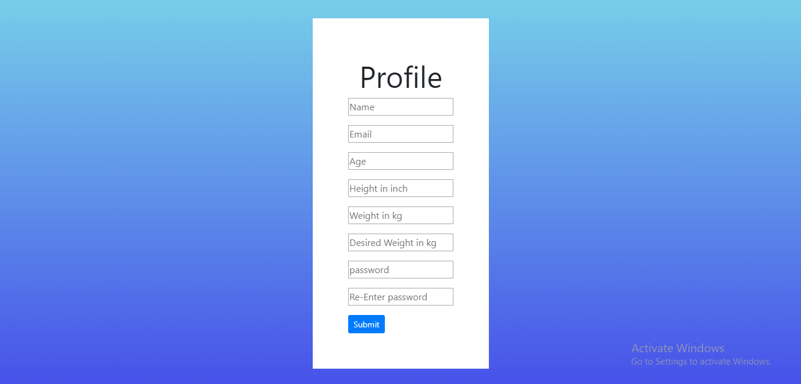
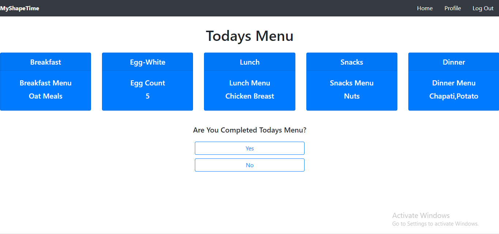

# MyShapeTimee

Fitness App using HTML,CSS,javaScript,Botstrap,NodeJS,ExpressJs,MongoDB.

## Application Name
MyShapeTimee

## Author:

[Aadesh Nichite](https://github.com/AadeshNichite)

[Varun](https://github.com/varunprabhakaran22)

## Technology Used:

HTML,Canvas, CSS, JavaScript, Bootstrap, NodeJS, ExpressJs, MongoDB

## Objective:

Create a Fitness App.

## Description

MyShapeTimee is the fitness app which help the user to reduce or gain the weight by recommending the right menu to the user based on his BMI.

## Demo 
Username: tom@gmail.com
Password: 8390646129 

## Images

#### +++++++++++++++++++++++++++++++++++++++++++++++++++++++++++++++++++++++++++++

#### +++++++++++++++++++++++++++++++++++++++++++++++++++++++++++++++++++++++++++++

#### +++++++++++++++++++++++++++++++++++++++++++++++++++++++++++++++++++++++++++++

## Video:
[MyShapeTime Video](https://drive.google.com/open?id=1XtF2c3Oq9U4VY0kfplF4IYIG-LbppXUk)

## Visit:
[MyShapeTime](https://vigilant-newton-b1af74.netlify.com)
